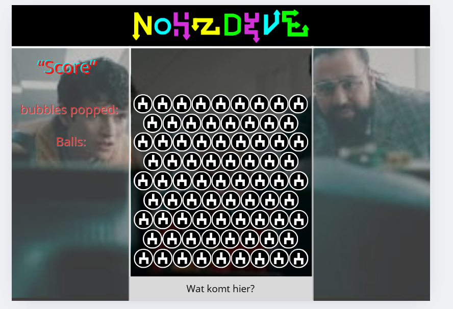
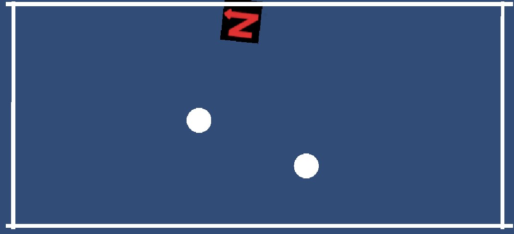

# M2-Unity
## Peggle

# Game is toch nog niet af, moet nog wat kleine aanpassingen maken!

## Genre
### Physics-based arcade puzzelgame.

## Beschrijving
### De speler moet het cannon richten en dan afvuren zodat de balletjes kapot gaan en daarmee gaat de score omhoog.
### Het spel is deels gebaseerd op Black Mirror: Bandersnatch, een interactieve film die (Niet meer) op netflix staat (Niet meer te kijken/spelen zonder het te piraten)
### [Trailer voor Bandersnatch](https://www.youtube.com/watch?v=7wnRi3Sclm8)

## Samenvatting van het spel en de mechanics:
### Je begint op het startscherm waarin je op start game kan klikken, je moet de muis ingedrukt houden en richten, je laat los om te schieten.
### Je kan niet verliezen maar als je de special feature wilt dan moet je een score van 19840 bereiken, dan gaat er een video van de film waar het design op gebaseerd is spelen.
### Als je klikt op restart game dan reset je level en dan verdwijnt de video weer.
### Als je klikt op exit level dan ga je weer naar het startscherm.

## Gameplaykern
### Bal: dat design komt later want ik ben er nog niet over uit.
### Targets: de witte balletjes.
### Score: je krijgt 80 punten per kapotgeschoten target.
### Doel: level is klaar als alle targets kapot zijn.

## Stijl en sfeer
### felle kleuren en veel contrast erin en geinspireerd door een aflevering van een netflixserie (Die van netflix is afgehaald en is daardoor nergens meer te bekijken (laat staan spelen) tenzij je hem pirate maar dat is echt een heel gedoe als je hem werkend wilt hebben).

## Structuur van het level
### Bovenaan: schietplek.
### Midden: veld met targets.
### Onderaan: is er niet, het is hetzelfde als het midden.

## Levelschets

## 2.1: forces & collision.
### Bal gemaakt en targets toegevoegd.

### [ShootBall](Peggle_game\Assets\scripts_peggle\ShootBall.cs)
### [TargetCollision](Peggle_game\Assets\scripts_peggle\TargetCollision.cs)

## 2.2: Aim, Shoot en Line.
### Werkend kanon gemaakt.

### [Aim](Peggle_game\Assets\scripts_peggle\Aim.cs)
### [Shoot](Peggle_game\Assets\scripts_peggle\Shoot.cs)

## 3.1: Score & Triggers.
### Score toegevoegd en peggles kunnen nu kapot.

### [Peggle](Peggle_game\Assets\scripts_peggle\Peggle.cs)
### [ScoreManager](Peggle_game\Assets\scripts_peggle\ScoreManager.cs)

## 3.2: Bumpers en Combo Systeem.
### Score kan nu veranderen met combos.

### [BumperHit](Peggle_game\Assets\scripts_peggle\BumperHit.cs)
### [ComboSysteem](Peggle_game\Assets\scripts_peggle\ComboSysteem.cs)

## 4.1: Leveldesign en UI.
### UI gemaakt.
### De game heeft nu een startscherm, een laadscherm en de game zelf (het laadscherm is gewoon voor tussen de scenes in tijdens het switchen van scenes)

## 4.2: Scores versturen.
### UI verder gemaakt en nu laat het de score en multiplier zien.

### [UIScoreBoard](Peggle_game\Assets\scripts_peggle\UIScoreBoard.cs)

## 5.2: Particles, Sounds en Shakes.
### Particles en audio toegevoegd aan de bumpers.
### Ik heb de 3de optie gekozen.

### [BumperHit](Peggle_game\Assets\scripts_peggle\BumperHit.cs)

## 6.1: Afronden en uitbreiden.

### Als er een score van 19840 wordt bereikt dan speelt er een video af in de achtergrond.
### [VideoManager](Peggle_game\Assets\scripts_peggle\VideoManager.cs)

## Reflectie – Week 1

### Beantwoord kort in je README:
#### ik heb deze week de schets gemaakt.
#### ik heb plezier gehad in canva(heel fijn programma).
#### ik liep nergens tegenaan maar het duurde gewoon best lang om te maken.
#### geen, daar waren we nog niet mee bezig.

## Reflectie - Week 2

#### Bal, kanon en targets gemaakt.
#### Vooral docent om hulp gevraagd maar ook op internet opgezocht.
#### Het ging prima maar ik liep soms vast.
#### Alles afgekregen.

## Reflectie - Week 3

#### Deze week score, bumpers en combosysteem gemaakt.
#### Docent om hulp gevraagd.
#### Het ging wel prima.
#### Alles af.

## Reflectie - Week 4

#### Ik heb de UI gemaakt en de mogelijkheid om tussen scenes te switchen toegepast.
#### Ik heb online dingen opgezocht.
#### Het ging vrijwel allemaal goed behalve dat ik nog met de resoluties bezig moet omdat ik die niet helemaal snap.
#### Alles gebruikt behalve de font.

## Reflectie - Week 5

#### De bumpers geven nu geluid en particles.
#### Docent om hulp gevraagd.
#### Het ging wel goed.
#### Alles af.

## Reflectie - Afronding

#### Wat ik wilde maken is voor het grootste gedeelte gelukt.
#### Ik heb veel nieuws geleerd maar dat ga ik niet gebruiken want ik ga fullstack kiezen.

## Idee(Hoort niet bij het conceptformat en is dus niet belangrijk)
### Een Colin Ritman inspired design maken? dus bijvoorbeeld iets met hetzelfde soort physieke design als Nohzdyve of mischien zelfs Bandersnatch?